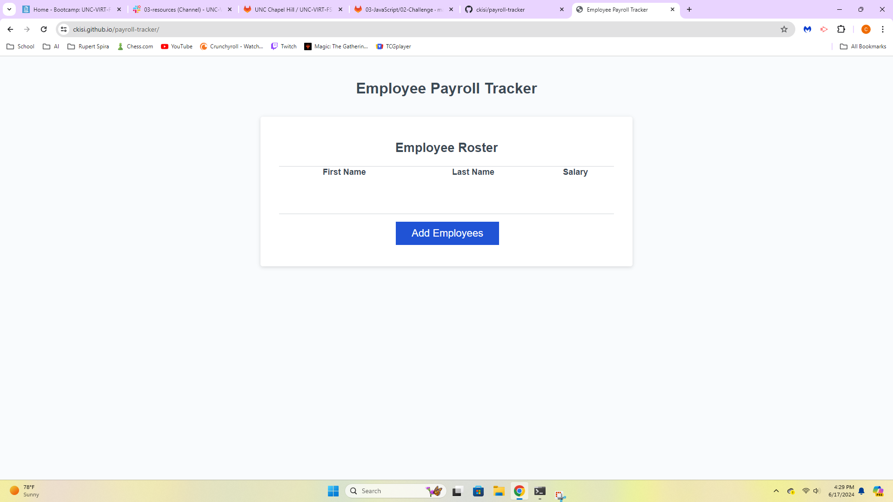

# Payroll Tracker

## Description
This is an employee payroll tracker made for payroll managers, so that they may see employees' payroll data and use it to budget. It can collect employee data, organize it, and display it onto the website using JavaScript.

## Usage
Clicking the "Add Employee" button will open a prompt which will allow you to enter the first name, last name, and salary of employee. Then you will be prompted to add another employee or cancel and it will log all of the entered emplyoees. Opening the console will give you the average salary of all the employees, as well as display a random winner out of the employees.

## Technologies
HTML, CSS, JavaScript

## Links
https://ckisi.github.io/payroll-tracker/
https://github.com/ckisi/payroll-tracker

## Screenshot

